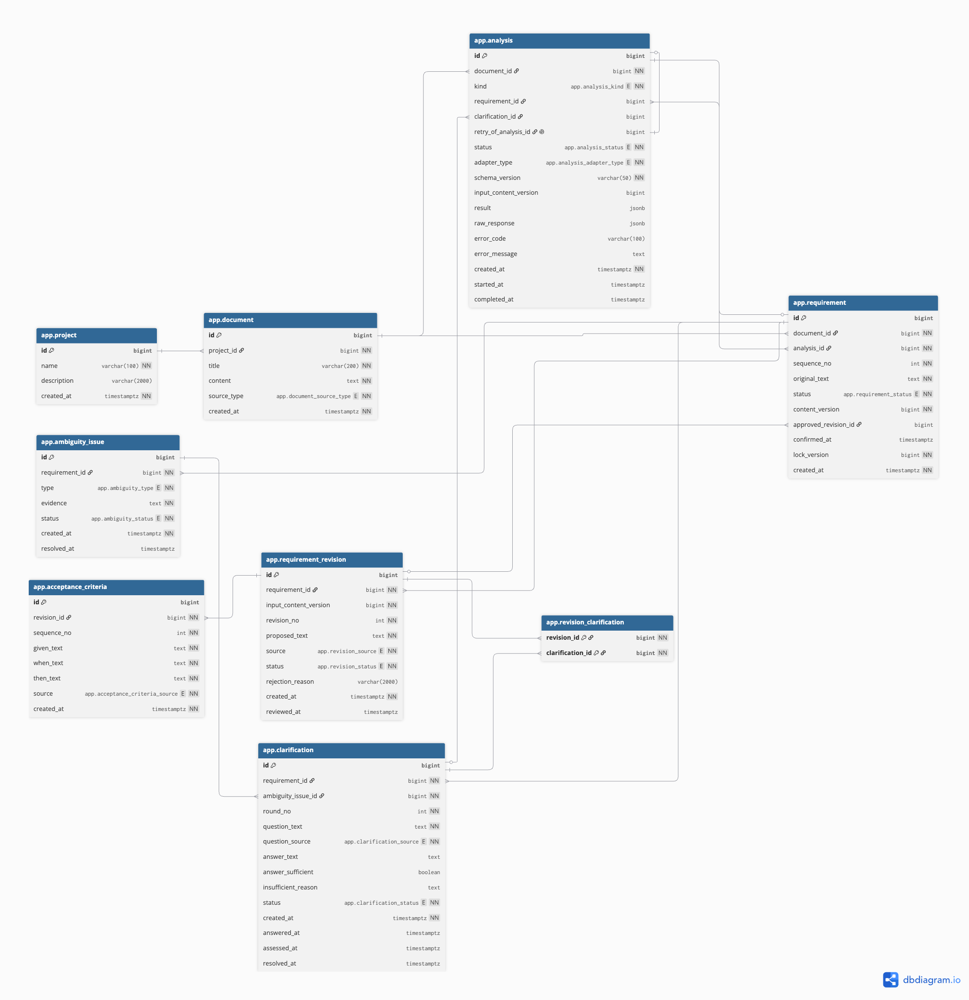

  

  <h1>ReqBridge</h1>

  

    <strong>모호한 고객 요구를 개발 가능한 기준으로 연결합니다.</strong>
  

  

    고객의 자연어 요구에서 빠진 기준을 찾고, 
    확인 질문부터 PM 승인과 개발팀 인계까지 하나의 Workflow로 관리하는 AI-Ready 서비스
  

  

    
    
    
    
  

  

    <a href="#01-why-reqbridge"><b>Why ReqBridge</b></a>
    &nbsp;·&nbsp;
    <a href="#02-core-experience"><b>Core Experience</b></a>
    &nbsp;·&nbsp;
    <a href="#04-ai-ready-by-design"><b>AI-Ready</b></a>
    &nbsp;·&nbsp;
    <a href="#07-team-reqbridge"><b>Team</b></a>
    &nbsp;·&nbsp;
    <a href="#09-getting-started"><b>Getting Started</b></a>
  

  SKALA Full-stack Engineering · AI Web Service Mini Project
    

---

## 01. Why ReqBridge

요구사항은 읽을 수 있는 문장에서 끝나지 않습니다. 개발 범위와 테스트 통과 여부를 판단할 수 있는 **측정 가능한 기준**이 필요합니다.

<table>
  <tr>
    <td width="50%" valign="top">
      BEFORE
      <h3>고객의 표현</h3>
      <blockquote>
        시스템은 <b>많은 사용자</b>의 요청에 
        <b>빠르게</b> 응답해야 한다.
      </blockquote>
      

        최대 몇 명인지 알 수 없음 
        무엇을 기준으로 빠른지 알 수 없음 
        완료와 성공을 판정할 수 없음
      

    </td>
    <td width="50%" valign="top">
      AFTER
      <h3>개발 가능한 기준</h3>
      <blockquote>
        최대 동시 사용자 <b>3,000명</b>의 상품 조회 부하 시험에서
        <b>p95 응답 시간 2초 이하</b>, 성공 응답 비율
        <b>99.9% 이상</b>을 만족해야 한다.
      </blockquote>
      

        구현 범위가 명확함 
        성능 측정 기준이 존재함 
        테스트 성공 여부를 판단할 수 있음
      

    </td>
  </tr>
</table>

ReqBridge는 PM이 반복하던 **기준 탐색 → 질문 작성 → 답변 판정 → 수정안 정리** 과정을 추적 가능한 하나의 흐름으로 연결합니다.

 

<table>
  <tr>
    <td align="center" width="25%">
      <h2>20</h2>
      최종 명세 업무 REST API
    </td>
    <td align="center" width="25%">
      <h2>7</h2>
      Ambiguity Types
    </td>
    <td align="center" width="25%">
      <h2>5</h2>
      Requirement States
    </td>
    <td align="center" width="25%">
      <h2>17 / 17</h2>
      Core E2E Flow
    </td>
  </tr>
</table>

## 02. Core Experience

<table>
  <tr>
    <td width="50%" valign="top">
      01 · DOCUMENT
      <h3>PDF · TEXT 요구사항 등록</h3>
      
프로젝트별로 텍스트 원문이나 최대 10MB PDF를 등록합니다. PDF 원본은 Private Storage에 보관하고 분석용 텍스트를 추출합니다.

    </td>
    <td width="50%" valign="top">
      02 · ANALYSIS
      <h3>등록 직후 자동 분석</h3>
      
문서 저장이 커밋되면 비동기 분석 작업을 자동 접수합니다. 화면은 Analysis 상태를 polling하며, 수동 분석 접수 API는 자동 접수 실패를 복구할 때 사용합니다.

    </td>
  </tr>
  <tr>
    <td width="50%" valign="top">
      03 · AMBIGUITY
      <h3>불명확성 근거 추적</h3>
      
수량·성능·조건·주체 등 7종의 불명확성 유형과 원문 근거를 Issue 단위로 구조화합니다.

    </td>
    <td width="50%" valign="top">
      04 · CLARIFICATION
      <h3>다중 회차 확인 질문</h3>
      
고객 답변이 충분한지 다시 판정하고, 기준이 부족하면 같은 Issue에 다음 회차 질문을 이어서 생성합니다.

    </td>
  </tr>
  <tr>
    <td width="50%" valign="top">
      05 · REVIEW
      <h3>PM 승인 Workflow</h3>
      
해결된 이슈와 답변을 근거로 수정안을 만들고, PM의 승인·거절·재생성을 거쳐 최종 요구사항을 확정합니다.

    </td>
    <td width="50%" valign="top">
      06 · PREVIEW
      <h3>대상별 Preview</h3>
      
대기 질문은 고객 질문서로, 승인된 수정안과 근거 답변은 개발팀 인계 화면으로 실시간 조합합니다.

    </td>
  </tr>
</table>

## 03. One Workflow, Two Outcomes

~~~mermaid
flowchart LR
    classDef input fill:#E7E9F8,stroke:#515CC0,color:#272D70
    classDef work fill:#FFF7ED,stroke:#F19A83,color:#6A3529
    classDef decision fill:#FEE4E4,stroke:#E68080,color:#702F2F
    classDef output fill:#E7F6EF,stroke:#46A878,color:#18583B

    A[PDF / TEXT 등록]:::input --> B[자동 분석]:::work
    B --> K{불명확성 발견}:::decision
    K -- 있음 --> C[요구사항·Issue·질문]:::work
    K -- 없음 --> L[원문 직접 승인]:::work
    C --> D[고객 답변 입력]:::work
    D --> E{답변이 충분한가?}:::decision
    E -- 아니오 --> C
    E -- 예 --> F[수정안 생성]:::work
    F --> G{PM 검토}:::decision
    G -- 거절 --> F
    G -- 승인 --> H[요구사항 확정]:::output
    L --> H

    C -. CLARIFYING .-> I[고객 질문서 Preview]:::output
    H -. CONFIRMED .-> J[개발팀 인계 Preview]:::output
~~~

  <code>EXTRACTED</code>
  &nbsp;→&nbsp;
  <code>AMBIGUOUS</code>
  &nbsp;→&nbsp;
  <code>CLARIFYING</code>
  &nbsp;→&nbsp;
  <code>IN_REVIEW</code>
  &nbsp;→&nbsp;
  <code>CONFIRMED</code>

### API 계약 현황 (v0.5.0)

최종 명세의 업무 API는 **총 20개**이며, P1 업무 API 18개와 P2 Preview API 2개로 구성됩니다.

| 구분 | 수량 | 상태 | 비고 |
| --- | ---: | --- | --- |
| P1 업무 API | 18개 | 구현 완료 | 프로젝트·문서·분석·요구사항·질문·수정안·직접 승인 Workflow |
| P2 Preview API | 2개 | 구현 완료 | 고객 질문서·개발팀 인계 Preview |
| 운영 API | 1개 | 구현 완료 | `GET /api/health`, 업무 API 수에서 제외 |

- TEXT/PDF 문서 등록은 `201`로 Document를 반환하며, 저장 커밋 후 최초 분석을 자동 접수합니다.
- `POST /api/documents/{documentId}/analyses`는 자동 접수 실패 복구용입니다. 활성 분석 또는 성공 이력이 있으면 `409`를 반환합니다.
- `POST /api/requirements/{requirementId}/confirm`은 불명확성이 없는 `EXTRACTED` 요구사항을 원문 그대로 승인합니다. 원문 기준 `MANUAL` Revision 생성·승인과 Requirement 확정을 한 트랜잭션으로 처리하고, 중복 요청에는 기존 확정 결과를 `200`으로 반환합니다.

## 04. AI-Ready by Design

현재 버전은 재현 가능한 시연을 위해 <strong>MockWorkflowAnalyzer</strong>를 사용합니다. 분석 기능은 <strong>WorkflowAnalyzer</strong> 계약 뒤에 분리되어 있어 실제 LLM Adapter를 추가해도 Workflow 상태 전이, 데이터 저장, REST API와 프런트엔드 계약은 그대로 유지됩니다.

~~~mermaid
flowchart TB
    USER[PM Browser] --> UI[Vue 3]
    UI -->|REST API| API[Spring Boot]

    subgraph APPLICATION[Application]
      API --> CORE[Project · Document · Requirement]
      API --> WF[Analysis · Issue · Clarification · Revision]
      API --> PREVIEW[Customer · Developer Preview]
      WF --> CONTRACT[WorkflowAnalyzer Contract]
      CONTRACT --> MOCK[Mock Adapter · Current]
      CONTRACT -.-> LLM[LLM Adapter · Future]
    end

    CORE --> DB[(Supabase PostgreSQL)]
    WF --> DB
    PREVIEW --> DB
    CORE --> STORAGE[(Supabase Private Storage)]
~~~

<table>
  <tr>
    <td width="33%" valign="top">
      PORT / ADAPTER
      <h3>Replaceable</h3>
      
Analyzer 구현체만 교체할 수 있도록 Port와 Adapter를 분리했습니다.

    </td>
    <td width="33%" valign="top">
      EXECUTION HISTORY
      <h3>Traceable</h3>
      
adapterType, schemaVersion, inputSnapshot과 실행 결과를 작업별로 보존합니다.

    </td>
    <td width="33%" valign="top">
      OUTPUT CONTRACT
      <h3>Validated</h3>
      
AI 출력은 별도 Validator를 통과한 뒤에만 업무 데이터로 반영됩니다.

    </td>
  </tr>
</table>

## 05. Tech Stack

<table>
  <tr>
    <th align="left">Layer</th>
    <th align="left">Stack</th>
  </tr>
  <tr>
    <td><b>Frontend</b></td>
    <td>Vue 3.5 · Vue Router 5 · Axios · Vite 8</td>
  </tr>
  <tr>
    <td><b>Backend</b></td>
    <td>Java 21 · Spring Boot 4.1 · Spring MVC · Spring Data JPA · Bean Validation</td>
  </tr>
  <tr>
    <td><b>Document</b></td>
    <td>Apache PDFBox 3</td>
  </tr>
  <tr>
    <td><b>Database</b></td>
    <td>Supabase PostgreSQL · Hibernate · Flyway</td>
  </tr>
  <tr>
    <td><b>Storage</b></td>
    <td>Supabase Private Storage</td>
  </tr>
  <tr>
    <td><b>API</b></td>
    <td>REST · JSON · Async Job & Polling · springdoc OpenAPI</td>
  </tr>
  <tr>
    <td><b>Test</b></td>
    <td>JUnit 5 · Spring Boot Test · MockMvc · Workflow E2E Script</td>
  </tr>
</table>

## 06. Scope

<table>
  <tr>
    <td width="50%" valign="top">
      CURRENT
      <h3>구현 완료</h3>
      <ul>
        <li>프로젝트·문서·요구사항 관리</li>
        <li>TEXT 등록과 PDF 업로드·텍스트 추출</li>
        <li>문서 등록 후 자동 분석</li>
        <li>7종 불명확성 Issue와 확인 질문</li>
        <li>불명확성 없는 요구사항 원문 직접 승인</li>
        <li>답변 재판정과 다중 회차 질문</li>
        <li>수정안 생성·거절·재생성·승인</li>
        <li>Customer / Developer Preview</li>
        <li>실패 작업 복구와 안전한 재시도</li>
        <li>실제 Backend / Frontend Mock 모드</li>
      </ul>
    </td>
    <td width="50%" valign="top">
      ROADMAP
      <h3>Next</h3>
      <ul>
        <li>실제 LLM WorkflowAnalyzer Adapter</li>
        <li>Given / When / Then Acceptance Criteria</li>
        <li>PDF·Word·CSV 결과 다운로드</li>
        <li>답변 대기·검토 요청 알림</li>
        <li>고객 계정과 직접 협업</li>
        <li>OCR·DOCX·다중 파일 입력</li>
      </ul>
    </td>
  </tr>
</table>

## 07. Team ReqBridge

<table>
  <tr>
    <td align="center" width="20%">
      <a href="https://github.com/sua918">
         
        <b>채수아</b>
      </a> 
      @sua918  
      <b>PM · Product</b>
    </td>
    <td align="center" width="20%">
      <a href="https://github.com/Laesar108">
         
        <b>이병주</b>
      </a> 
      @Laesar108  
      <b>Frontend</b>
    </td>
    <td align="center" width="20%">
      <a href="https://github.com/5solemi5">
         
        <b>최은주</b>
      </a> 
      @5solemi5  
      <b>Frontend · UX</b>
    </td>
    <td align="center" width="20%">
      <a href="https://github.com/HyeongjunHan">
         
        <b>한형준</b>
      </a> 
      @HyeongjunHan  
      <b>Backend · Infra</b>
    </td>
    <td align="center" width="20%">
      <a href="https://github.com/shsgrnd">
         
        <b>신형섭</b>
      </a> 
      @shsgrnd  
      <b>Backend · AI</b>
    </td>
  </tr>
</table>

| Member | Responsibility |
| --- | --- |
| **채수아 · PM/Product** | 서비스 기획, 요구사항·일정 관리, 통합 검토, 발표, 제품 UI 개선 |
| **이병주 · Frontend** | Vue 기반 구조, Router·API Client, 공통 컴포넌트, 문서·분석 화면 |
| **최은주 · Frontend/UX** | 질문·답변 Workflow, 결과 Preview, 디자인 시스템과 사용성 개선 |
| **한형준 · Backend/Infra** | Project·Document·Requirement, Supabase DB·Storage, PDF 업로드, Preview API |
| **신형섭 · Backend/AI** | AI-Ready Workflow, Mock Analyzer, Issue·Clarification·Revision, API 계약 |

## 08. Repository

~~~text
ReqBridge/
├─ frontend/
│  ├─ public/                 # Brand assets
│  ├─ scripts/                # Frontend verification
│  └─ src/
│     ├─ api/                 # REST API clients
│     ├─ components/          # Shared UI
│     ├─ composables/         # Polling and error handling
│     ├─ mocks/               # In-memory demo data
│     └─ views/               # Project · Document · Workflow · Preview
├─ backend/
│  ├─ src/main/java/          # Domain · Service · Controller
│  ├─ src/main/resources/     # Configuration · DB migrations
│  └─ src/test/               # Unit · integration tests
├─ docs/
│  ├─ api/                    # API specification · E2E
│  ├─ backend/                # DB · AI · backend design
│  ├─ frontend/               # Frontend collaboration
│  └─ mock/                   # Demo runbook · sample input
└─ docker-compose.yml         # Local PostgreSQL
~~~

## 09. Getting Started

아래 순서는 새 개발 환경에서 **Supabase 기반 실제 Backend와 Frontend를 함께 실행하는 기준**입니다.

<table>
  <tr>
    <td align="center"><b>Java</b> <code>21</code></td>
    <td align="center"><b>Node.js</b> <code>24</code></td>
    <td align="center"><b>npm</b> <code>11+</code></td>
    <td align="center"><b>Database</b> <code>Supabase PostgreSQL</code></td>
  </tr>
</table>

<b>Step 1. 저장소 내려받기</b>

 

~~~bash
git clone https://github.com/sua918/SKALA-ReqBridge.git
cd SKALA-ReqBridge
~~~

<b>Step 2. Supabase Database 준비</b>

 

Supabase Dashboard에서 프로젝트를 만든 뒤 <b>SQL Editor</b>를 엽니다. 새 DB에 아래 파일의 SQL을 <b>V1부터 V4까지 한 파일씩 순서대로</b> 실행합니다.

~~~text
backend/src/main/resources/db/migration/
├─ V1__initial_schema.sql
├─ V2__requirement_status_workflow.sql
├─ V3__document_file_source.sql
└─ V4__document_file_metadata.sql
~~~

각 파일의 실행이 성공한 다음 다음 버전으로 넘어갑니다. <code>supabase</code> 프로필에서는 Flyway가 꺼져 있으므로 애플리케이션 실행만으로 테이블이 자동 생성되지 않습니다.

> V1은 초기 빈 스키마용입니다. 이미 ReqBridge 테이블과 데이터가 있는 DB에는 V1을 다시 실행하지 않습니다.

<b>Step 3. PDF Storage 준비</b>

 

PDF 업로드를 사용한다면 Supabase Dashboard의 <b>Storage</b>에서 다음 bucket을 생성합니다.

| 설정 | 값 |
| --- | --- |
| Bucket name | <code>reqbridge-documents</code> |
| Public bucket | 비활성화 |
| 허용 MIME | <code>application/pdf</code> |
| 파일 크기 | 10MB 이상 허용 |

Frontend가 Storage에 직접 접근하는 정책은 추가하지 않습니다. 파일 업로드와 삭제는 Backend의 <code>service_role</code> 권한으로 처리합니다.

> TEXT 문서 기능만 확인한다면 Storage 설정은 생략할 수 있습니다.

<b>Step 4. Supabase 연결 정보 확인</b>

 

Supabase Dashboard의 <b>Connect</b> 화면에서 <b>Session pooler</b> 정보를 확인합니다.

| 항목 | 기준 |
| --- | --- |
| Host | Dashboard에 표시된 Session pooler host |
| Port | <code>5432</code> |
| Database | <code>postgres</code> |
| Username | <code>postgres.&lt;project-ref&gt;</code> |
| SSL | <code>sslmode=require</code> |

Spring Boot와 Hibernate의 prepared statement를 사용하므로 Transaction pooler의 <code>6543</code> 포트는 사용하지 않습니다.

<b>Step 5. Backend 환경변수 등록</b>

 

Spring Boot는 .env 파일을 자동으로 읽지 않습니다. Backend를 실행할 터미널이나 IDE Run Configuration에 값을 등록합니다.

Windows PowerShell:

~~~powershell
$env:SPRING_PROFILES_ACTIVE = "supabase"
$env:SUPABASE_DB_URL = "jdbc:postgresql://<session-pooler-host>:5432/postgres?sslmode=require"
$env:SUPABASE_DB_USERNAME = "postgres.<project-ref>"
$env:SUPABASE_DB_PASSWORD = "<database-password>"

$env:SUPABASE_URL = "https://<project-ref>.supabase.co"
$env:SUPABASE_STORAGE_BUCKET = "reqbridge-documents"
$env:SUPABASE_SERVICE_ROLE_KEY = "<server-only-service-role-key>"
~~~

macOS · Linux:

~~~bash
export SPRING_PROFILES_ACTIVE="supabase"
export SUPABASE_DB_URL="jdbc:postgresql://<session-pooler-host>:5432/postgres?sslmode=require"
export SUPABASE_DB_USERNAME="postgres.<project-ref>"
export SUPABASE_DB_PASSWORD="<database-password>"

export SUPABASE_URL="https://<project-ref>.supabase.co"
export SUPABASE_STORAGE_BUCKET="reqbridge-documents"
export SUPABASE_SERVICE_ROLE_KEY="<server-only-service-role-key>"
~~~

DB 비밀번호와 <code>service_role</code> key는 소스, Frontend 환경변수, 커밋에 포함하지 않습니다.

<b>Step 6. Backend 실행과 상태 확인</b>

 

Windows PowerShell:

~~~powershell
cd backend
.\gradlew.bat bootRun
~~~

macOS · Linux:

~~~bash
cd backend
./gradlew bootRun
~~~

다음 로그가 확인되면 정상적으로 실행된 상태입니다.

~~~text
The following 1 profile is active: "supabase"
HikariPool ... Start completed
Started ReqbridgeApplication
~~~

새 터미널에서 Health API를 확인합니다.

~~~powershell
Invoke-RestMethod http://localhost:8080/api/health
~~~

Swagger UI는 <a href="http://localhost:8080/swagger-ui/index.html">http://localhost:8080/swagger-ui/index.html</a>에서 확인할 수 있습니다.

<b>Step 7. Frontend 실행</b>

 

새 터미널을 열고 저장소의 <code>frontend</code> 디렉터리에서 실행합니다.

~~~bash
cd frontend
npm ci
npm run dev
~~~

브라우저에서 <a href="http://localhost:5173">http://localhost:5173</a>에 접속합니다. 개발 서버의 <code>/api</code> 요청은 <code>http://localhost:8080</code> Backend로 전달됩니다.

<b>Backend 없이 Frontend만 확인하기</b>

 

Frontend 메모리 Mock은 Supabase와 Spring Boot 없이 화면과 Workflow를 확인하는 모드입니다.

~~~bash
cd frontend
npm ci
npm run dev:mock
~~~

<table>
  <tr>
    <td align="center"><b>Frontend</b> <a href="http://localhost:5173">localhost:5173</a></td>
    <td align="center"><b>Backend</b> <a href="http://localhost:8080">localhost:8080</a></td>
    <td align="center"><b>Health</b> <a href="http://localhost:8080/api/health">/api/health</a></td>
    <td align="center"><b>Swagger</b> <a href="http://localhost:8080/swagger-ui/index.html">/swagger-ui</a></td>
  </tr>
</table>

<b>Local PostgreSQL로 실행하기</b>

 

Supabase 대신 Docker의 로컬 PostgreSQL을 사용하려면 저장소 루트에서 실행합니다.

~~~powershell
Copy-Item .env.example .env
docker compose up -d
~~~

그다음 별도의 터미널에서 Backend를 기본 프로필로 실행합니다.

~~~powershell
cd backend
.\gradlew.bat bootRun
~~~

기본 프로필에서는 Flyway가 V1부터 V4까지 자동으로 적용합니다.

<b>실행 오류 빠르게 확인하기</b>

 

| 증상 | 확인할 항목 |
| --- | --- |
| DB 연결 timeout | Direct host 대신 Session pooler host와 5432 포트를 사용했는지 확인 |
| password authentication failed | pooler username과 프로젝트 DB 비밀번호 확인 |
| relation app.project does not exist | Supabase SQL Editor에 V1~V4를 순서대로 적용했는지 확인 |
| Hibernate validation 실패 | 적용한 Migration과 현재 코드 버전이 같은지 확인 |
| PDF 업로드 500 | Private bucket 이름, Supabase URL, service_role key 확인 |
| Frontend API 연결 실패 | Backend 8080 실행 여부와 <code>/api/health</code> 응답 확인 |

## 10. Verification

<table>
  <tr>
    <td width="33%" valign="top">
      <h3>Backend</h3>
      <pre><code>cd backend
.\gradlew.bat test</code></pre>
    </td>
    <td width="33%" valign="top">
      <h3>Frontend</h3>
      <pre><code>cd frontend
npm run build
npm run build:mock</code></pre>
    </td>
    <td width="33%" valign="top">
      <h3>Workflow E2E</h3>
      <pre><code>bash docs/api/test_api.sh</code></pre>
    </td>
  </tr>
</table>

E2E는 프로젝트·문서 등록부터 자동 분석, 불명확성 없는 요구사항 직접 승인, 다중 회차 질문, 수정안 거절·재생성·승인, 대상별 Preview와 중복 검토 차단까지 확인합니다.

## 11. Documentation

<table>
  <tr>
    <td width="50%" valign="top">
      PROJECT
      <h3>기획과 설계</h3>
      <ul>
        <li><a href="https://reqbridge.qaa.kr">설계 문서 모음 ↗</a></li>
      </ul>
    </td>
    <td width="50%" valign="top">
      ENGINEERING
      <h3>API와 데이터</h3>
      <ul>
        <li><a href="./docs/api/ReqBridge_API_Specification.md">REST API 명세</a></li>
        <li><a href="./docs/ERD_ReqBridge.png">Entity Relationship Diagram</a></li>
      </ul>
    </td>
  </tr>
</table>

<b>ERD 미리보기</b>

 

  

---

  
  <h3>ReqBridge</h3>
  
<b>모호한 요구를 명확한 기준으로.</b>

